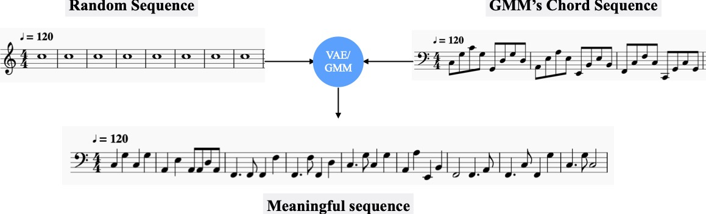
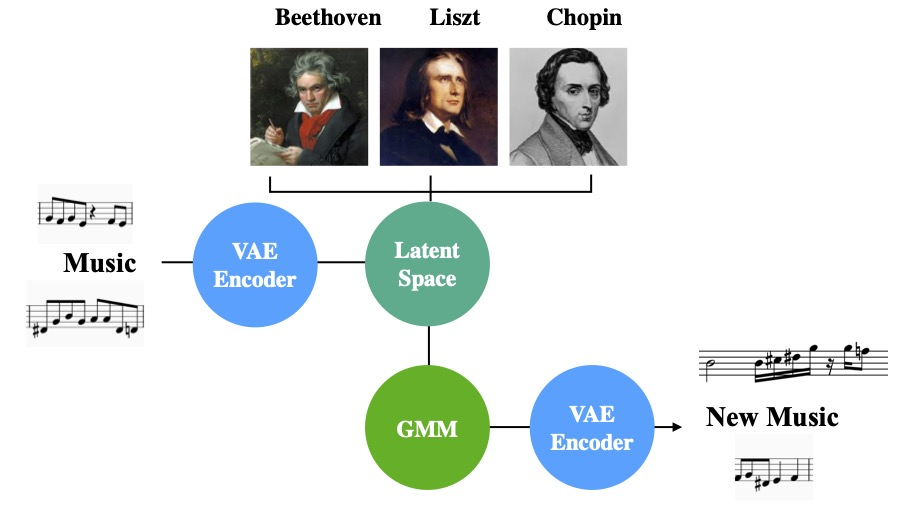
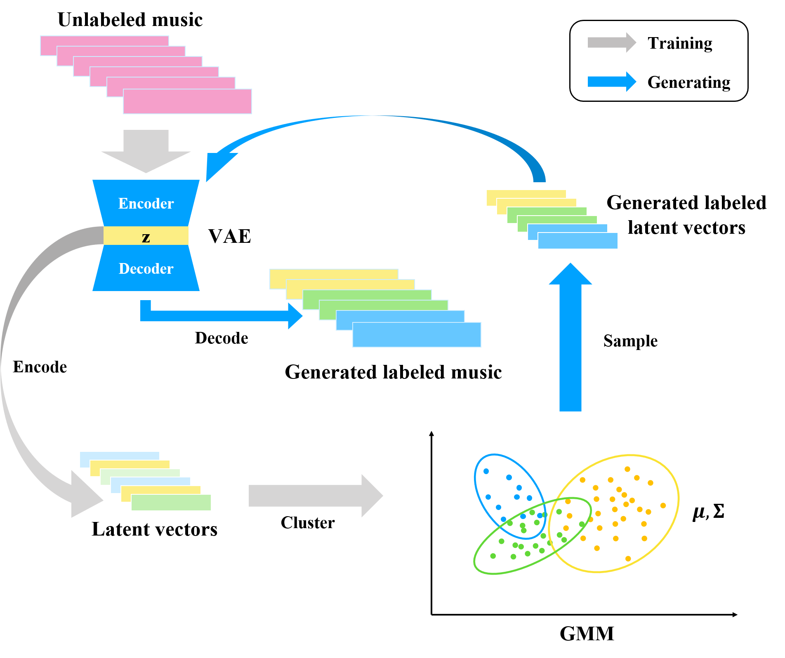

# Controlled Music Generation from Unlabeled Data

## Demo audios and midis
We input an sequence [random sequence](./assets/midis/random_sample.mid) into the VAE and get its latent vector V1
:



We use GMM to get a latent vector V2 which can describe a type of chord sequence like
[GMM's chord sequence](./assets/midis/chord_sample.mid):



We do interpolation using V1 and V2 and get V3 to do the music generate with VAE, then we get 
[Meaningful sequence](./assets/midis/merge_sample.mid):



If we listen the [GMM's chord sequence midi](./assets/midis/merge_sample.mid) and 
[Meaningful sequence](./assets/midis/chord_sample.mid) together, we will find 
they are harmonious



No training is needed! GMM help us find useful information from latent space effectively!

 
Mix a sequence corresponding to a chord style with a random sequence. The note sequence extracted from the GMM model is capable to endow any random note sequence the same style of music tone. Hence, generate meaningful mixture which is harmonic with each other.

## Pipeline
Overview of controlled music generation from unlabeled data with VAE and GMM. Both training procedure and generating procedure are included.

 

## Method
VAE+GMM pipeline for music generation. Firstly we extract latent variables from different composers' music pieces. Later, the GMM model clusters the latent variables and provides cluster membership information(eg. composer's style). We pass new latent variables sampled from GMM to VAE, then decode them to new music sequences.

 

## Demo video


