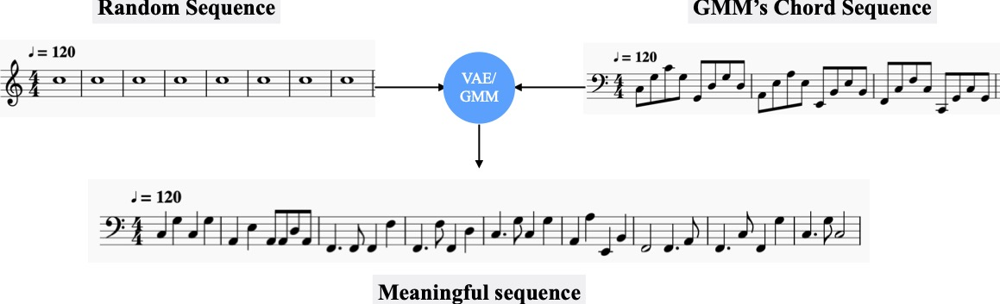
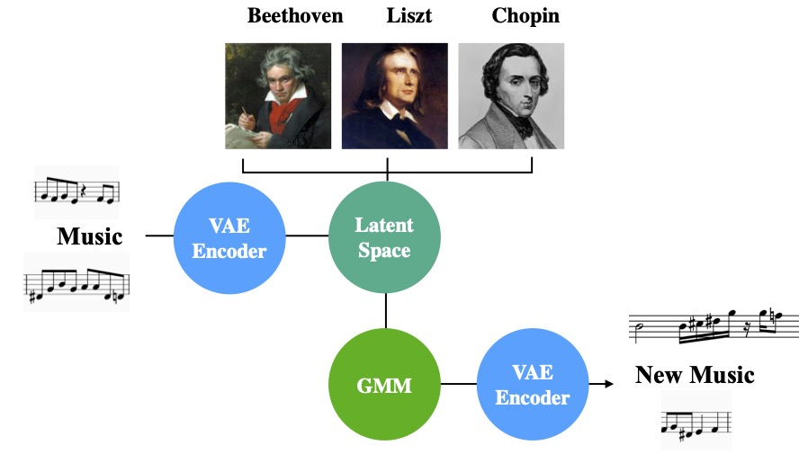
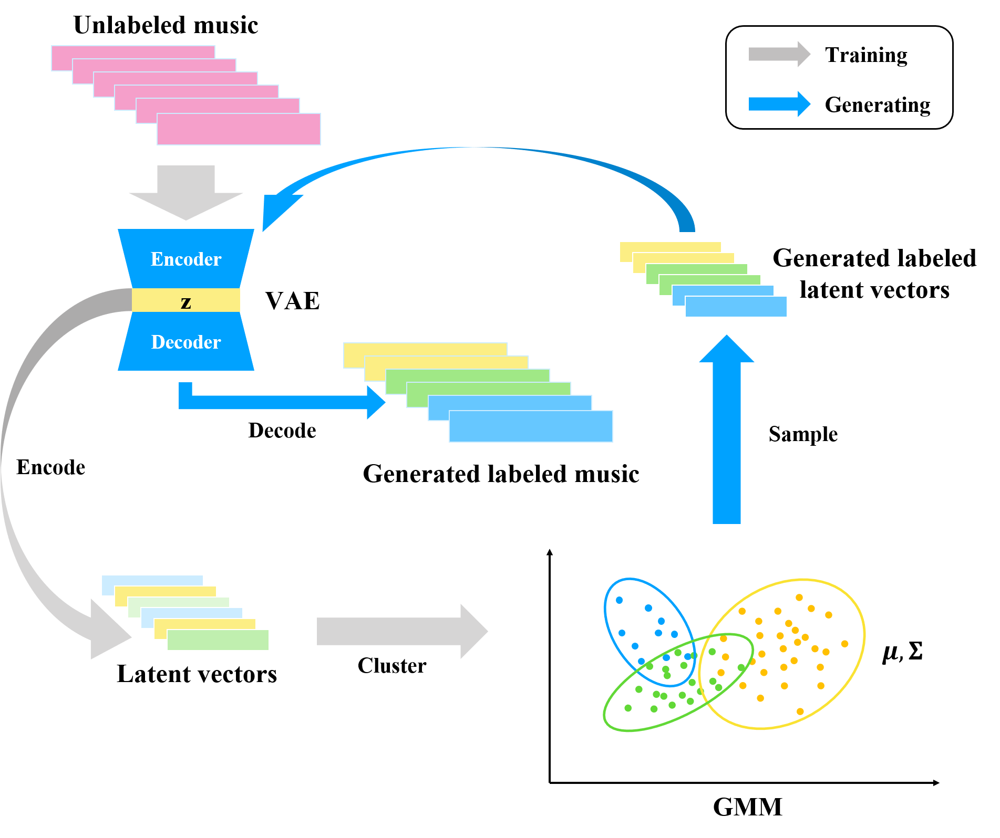

# Controlled Music Generation from Unlabeled Data

## Demo midis
Style midi:



Original midi:



Chord midi:



 
Mix a sequence corresponding to a chord style with a random sequence. The note sequence extracted from the GMM model is capable to endow any random note sequence the same style of music tone. Hence, generate meaningful mixture which is harmonic with each other.

## Pipeline
Overview of controlled music generation from unlabeled data with VAE and GMM. Both training procedure and generating procedure are included.

 

## Method
VAE+GMM pipeline for music generation. Firstly we extract latent variables from different composers' music pieces. Later, the GMM model clusters the latent variables and provides cluster membership information(eg. composer's style). We pass new latent variables sampled from GMM to VAE, then decode them to new music sequences.

 

